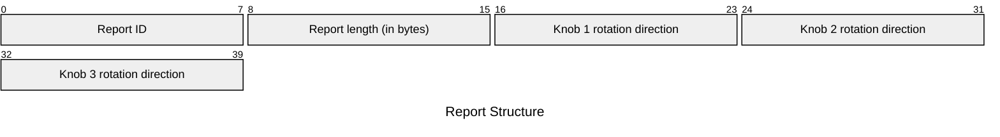
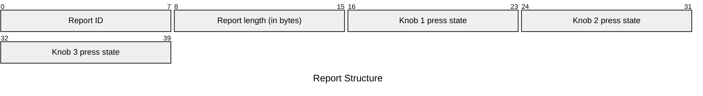

# M003K Input Reports

## Channel 0 (Tag `0x2a`)

### `0x00` - Knob Rotation Event

| Element | Description | Acceptable Values |
| --- | --- | --- |
| Report ID | The ID of the report. | Always `0x00` (`0`). |
| Report length | The number of remaining bytes in the report. | Always `0x03` (`3`), matching the number of knobs. |
| Knob 1 rotation direction | The direction of rotation for Knob 1. | Either `0x00` (`0`) for counter-clockwise or `0x01` (`1`) for clockwise. The value `0xff` (`255`) appears to denote "no change." |
| Knob 2 rotation direction | The direction of rotation for Knob 2. | Either `0x00` (`0`) for counter-clockwise or `0x01` (`1`) for clockwise. The value `0xff` (`255`) appears to denote "no change." |
| Knob 3 rotation direction | The direction of rotation for Knob 3. | Either `0x00` (`0`) for counter-clockwise or `0x01` (`1`) for clockwise. The value `0xff` (`255`) appears to denote "no change." |

Example: `00 03 01 ff ff`

Each knob has haptic feedback every 12°, when it will generate an input report. A full rotation would produce 30 input reports.

### `0x03` - Knob Press Event

| Element | Description | Acceptable values |
| --- | --- | --- |
| Report ID | The ID of the report. | Always `0x03` (`3`). |
| Report length | The number of remaining bytes in the report. | Always `0x03` (`3`), matching the number of knobs. |
| Knob 1 press state | The press state of Knob 1. | Either `0x00` (`0`) for not pressed or `0x01` (`1`) for pressed. |
| Knob 2 press state | The press state of Knob 2. | Either `0x00` (`0`) for not pressed or `0x01` (`1`) for pressed. |
| Knob 3 press state | The press state of Knob 3. | Either `0x00` (`0`) for not pressed or `0x01` (`1`) for pressed. |

Example: `03 03 01 00 00`

## Channel 1 (Tag `0x2b`)

No reports have been found for this channel.

## Channel 2 (Tag `0x2c`)

No reports have been found for this channel.

## Channel 3 (Tag `0x2d`)

No reports have been found for this channel.

## Channel 4 (Tag `0x2e`)

No reports have been found for this channel.
