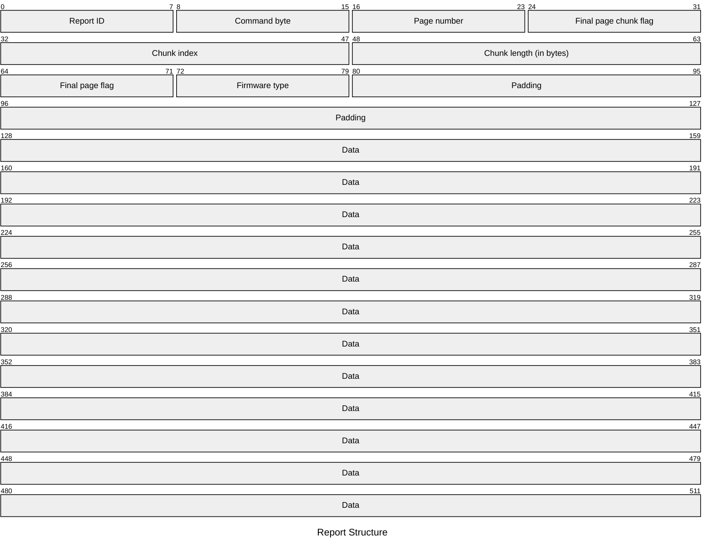
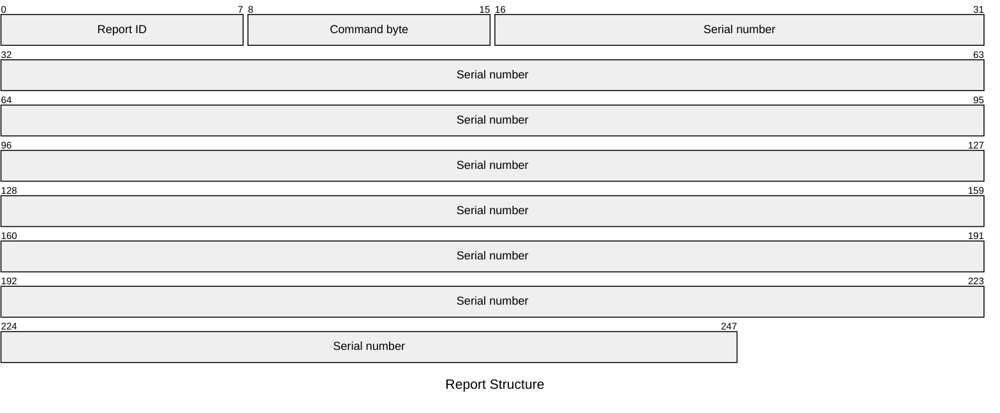
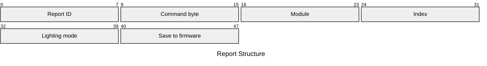
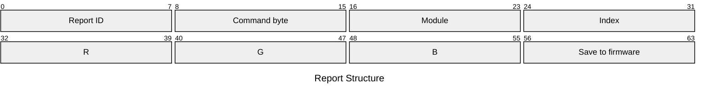
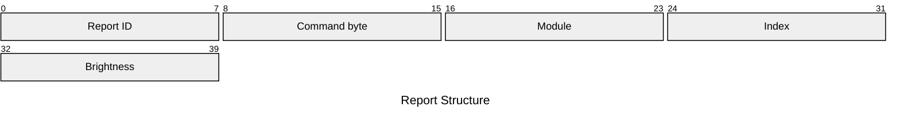

# M003K Output Reports

## Report ID `0x02`

### Command `0x2a` - Update FW



| Element | Description | Acceptable Values |
| --- | --- | --- |
| Report ID | The ID of the report. | Always `0x02` (`2`). |
| Command byte | The operation to perform. | Always `0x2a` (`42`). |
| Page number | The current page number. | Integers in the range `[0x00, 0xff]` (`[0, 255]`). |
| Final page chunk flag | Whether the current chunk is the last chunk in the page. | Either `0x00` (`0`) if `false` or `0x01` (`1`) if `true`. |
| Chunk index | The current chunk index. | Integers in the range `[0x00, 0xff]` (`[0, 255]`). |
| Chunk length | The length of the current chunk in bytes. | Integers in the range `[0x00, 0xff]` (`[0, 255]`). |
| Final page flag | Whether the current page is the last page. | Either `0x00` (`0`) if `false` or `0x01` (`1`) if `true`. |
| Firmware type | The type of firmware image. | Integers in the range `[0x00, 0xff]` (`[0, 255]`). Only `0x01` (`1`) seems to be used. |
| Padding | 6 bytes of `0x00` (`0`) to align the data to start on byte `0x10` (`16`). | n/a |
| Data | Sequence of up to 48 bytes containing the raw firmware data. | Integers in the range `[0x00, 0xff]` (`[0, 255]`). |

> **WARNING**
>
> Firmware updates can render the module inoperable. Only use official Cooler Master firmware packages in a power-controlled environment.

This is a pretty standard large data transfer method. The microcontroller page size is `0x1000` (`4096`) bytes, with `0x40` (`64`) bytes being the size of the USB HID packet. Knowing this, we split the firmware data into `0x1000`-byte (`4096`-byte) pages with each page being split into `0x30`-byte (`48`-byte) chunks. The remaining `0x10` (`16`) bytes make up the packet header.

#### Algorithm

The following algorithm may be used to send a sequence of bytes (`firmware`) to a HID (`device`).

```
update_firmware(device, firmware):
    firmware_len ← |firmware|

    if firmware = ∅ ∨ firmware_len = 0:
        return

    REPORT_LEN ← 0x40
    CHUNK_MAX  ← REPORT_LEN - 0x10     -- 0x30
    PAGE_SIZE  ← 0x1000

    n_pages    ← ⌈firmware_len / PAGE_SIZE⌉
    last_page  ← n_pages - 1

    report ← [0x00 × REPORT_LEN]
    report[0] ← 0x02
    report[1] ← 0x2A
    report[9] ← 0x01                    -- firmware type

    for page ∈ [0, n_pages):
        page_size ← firmware_len - page × PAGE_SIZE          -- bytes remaining in firmware
        page_size ← min(page_size, PAGE_SIZE)

        remaining   ← page_size
        chunk_index ← 0

        report[2] ← page
        report[3] ← 0
        report[8] ← 0

        while remaining > 0:
            chunk_len ← min(remaining, CHUNK_MAX)

            is_last_chunk_of_page ← remaining ≤ CHUNK_MAX
            is_last_page          ← page = last_page

            report[3]    ← is_last_chunk_of_page ? 1 : 0
            report[8]    ← is_last_chunk_of_page ∧ is_last_page ? 1 : 0
            report[4..6] ← chunk_index as u16 (LE)
            report[6..8] ← chunk_len   as u16 (LE)

            src_offset ← page × PAGE_SIZE + (page_size - remaining)
            report[0x10 .. 0x10 + chunk_len] ← firmware[src_offset .. src_offset + chunk_len]
            report[0x10 + chunk_len .. REPORT_LEN] ← 0x00

            call hid_write(device, report, REPORT_LEN)

            chunk_index ← chunk_index + 1
            remaining   ← remaining - chunk_len
```

> **NOTE**
>
> The SDK limits the firmware size based on the firmware type. If the firmware type is `0x00` (`0`), then the maximum size of the firmware is `0x0fff` (`4095`) bytes (4.095 kilobytes). If the firmware type is in the range `[0x01, 0xff]` (`[1, 255]`), then the maximum size is `0xa000` (`40960`) bytes (40.96 kilobytes). In practice, the SDK appears to only use `0x01` (`1`).
>
> This firmware type may have some relation to the 3 firmware retrievals (feature reports `0x2d`, `0x2e`, and `0x2f`) but this is unconfirmed.

### Command `0x2b` - Set Serial Number



| Element | Description | Acceptable Values |
| --- | --- | --- |
| Report ID | The ID of the report. | Always `0x02` (`2`). |
| Command byte | The operation to perform. | Always `0x2b` (`43`). |
| Serial number | The serial number string. | A UTF-8 encoded string with up to 29 bytes. |

> **NOTE**
>
> The SDK checks whether the serial number is less than or equal to `0x1d` (`29`). It is unclear at this point if that includes the C-style `null` terminator at the end of the string. The byte buffer is size `0x20` (`32`); if the `null` terminator is included then we would fill `0x1f` (`31`) bytes, while if it was not included we would fill all `0x20` (`32`) bytes.
>
> It's possible the last byte is potentially unused or an implicit `null` terminator. In practice, the serial numbers seem to only be about 20 characters.

### Command `0x2c` - Adjust LED Mode



| Element | Description | Acceptable Values |
| --- | --- | --- |
| Report ID | The ID of the report. | Always `0x02` (`2`). |
| Command byte | The operation to perform. | Always `0x2c` (`44`). |
| Module | The M0 module to target. | Always `0x02` (`2`). |
| Index | The LED index to target. | Integers in the range `[0x00, 0x02]` (`[0, 2]`) for an individual knob, or `0xff` (`255`) for all. |
| Lighting mode | The lighting mode (effect) to display. | Any [lighting mode](../../lighting_modes.md). |
| Save to firmware | Whether the lighting mode (effect) should persist through restarts. | Either `0x00` (`0`) if `false` or `0x01` (`1`) if `true`. |

Example: `02 2c 02 ff 09 01`

### Command `0x2d` - Adjust LED Color



| Element | Description | Acceptable Values |
| --- | --- | --- |
| Report ID | The ID of the report. | Always `0x02` (`2`). |
| Command byte | The operation to perform. | Always `0x2d` (`45`). |
| Module | The M0 module to target. | Always `0x02` (`2`). |
| Index | The LED index to target. | Integers in the range `[0x00, 0x02]` (`[0, 2]`) for an individual knob, or `0xff` (`255`) for all. |
| R | The red channel of the RGB color. | Integers in the range `[0x00, 0xFF]` (`[0, 255]`). |
| G | The green channel of the RGB color. | Integers in the range `[0x00, 0xFF]` (`[0, 255]`). |
| B | The blue channel of the RGB color. | Integers in the range `[0x00, 0xFF]` (`[0, 255]`). |
| Save to firmware | Whether the color should persist through restarts. | Either `0x00` (`0`) if `false` or `0x01` (`1`) if `true`. |

Example: `02 2d 02 ff 33 24 3f 01`

> **IMPORTANT**
>
> The color is not displayed in all [lighting modes](../../lighting_modes.md). Only `Static`, `Breathing`, `Strobe`, and `Spring` will display the color.

### Command `0x2e` - Adjust LED Brightness



| Element | Description | Acceptable Values |
| --- | --- | --- |
| Report ID | The ID of the report. | Always `0x02` (`2`). |
| Command byte | The operation to perform. | Always `0x2e` (`46`). |
| Module | The M0 module to target. | Always `0x02` (`2`). |
| Index | The LED index to target. | Integers in the range `[0x00, 0x02]` (`[0, 2]`) for an individual knob, or `0xff` (`255`) for all. |
| Brightness | The LED brightness. | Integers in the range `[0x00, 0x64]` (`[0, 100]`). |

Example: `02 2e 02 ff 64`

### Command `0x2f` - Calibrate Direction


| Element | Description | Acceptable Values |
| --- | --- | --- |
| Report ID | The ID of the report. | Always `0x02` (`2`). |
| Command byte | The operation to perform. | Always `0x2f` (`47`). |

Example: `02 2f`

This report appears to have no effect on the device.

### Command `0x30` - Adjust LED Speed


| Element | Description | Acceptable Values |
| --- | --- | --- |
| Report ID | The ID of the report. | Always `0x02` (`2`). |
| Command byte | The operation to perform. | Always `0x30` (`48`). |
| Speed | The LED speed. | Integers in the range `[0x00, 0x64]` (`[0, 100]`). |

Example: `02 30 64`

This report appears to have no effect on the device in any [lighting mode](../../lighting_modes.md).

### Command `0x31` - Save Factory Data


| Element | Description | Acceptable Values |
| --- | --- | --- |
| Report ID | The ID of the report. | Always `0x02` (`2`). |
| Command byte | The operation to perform. | Always `0x31` (`49`). |

This output report appears in the SDK but it is unclear what, if anything, it does.

### Command `0x32` - Get Config Data


| Element | Description | Acceptable Values |
| --- | --- | --- |
| Report ID | The ID of the report. | Always `0x02` (`2`). |
| Command byte | The operation to perform. | Always `0x32` (`50`). |

This output report appears to have no effect on the device.

### Command `0x33` - Get Config Data


| Element | Description | Acceptable Values |
| --- | --- | --- |
| Report ID | The ID of the report. | Always `0x02` (`2`). |
| Command byte | The operation to perform. | Always `0x33` (`51`). |

This output report appears to have no effect on the device.

### Command `0x49` - Test FW Recovery Process


| Element | Description | Acceptable Values |
| --- | --- | --- |
| Report ID | The ID of the report. | Always `0x02` (`2`). |
| Command byte | The operation to perform. | Always `0x49` (`73`). |

This output report appears to reset the firmware to a known state. This state probably comes from feature report `0x2f`, as sending it seems to cause feature report `0x2e` to have the same version number as `0x2f`.

### Command `0x4a` - Test Factory Reset Process


| Element | Description | Acceptable Values |
| --- | --- | --- |
| Report ID | The ID of the report. | Always `0x02` (`2`). |
| Command byte | The operation to perform. | Always `0x4a` (`74`). |

This output report appears to reset all device settings to their default. This does not appear to revert back to the original firmware version, but rather resets LED brightness, color, mode, etc.
