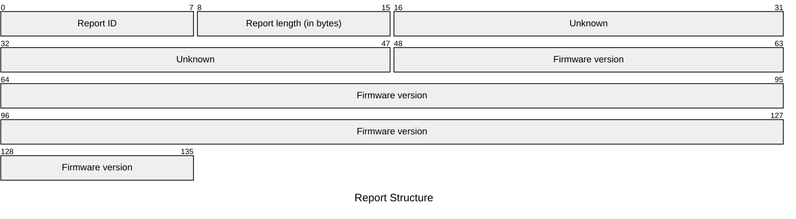
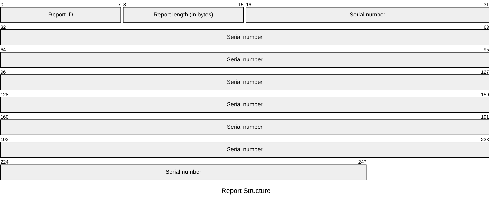
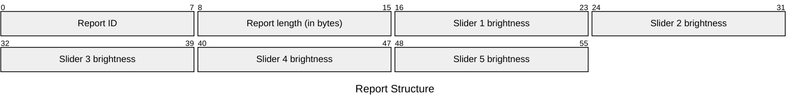
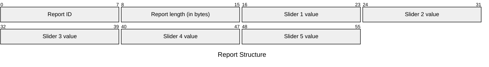

# M005S Feature Reports

## Get Feature Reports

### `0x2d` - Get FW Infos

| Element | Description | Acceptable Values |
| --- | --- | --- |
| Report ID | The ID of the report. | Always `0x2d` (`45`) |
| Report length | The number of remaining bytes in the report. | Potentially `0x00` (`0`) to `0x78` (`120`) |
| Unknown | The purpose has not been discovered. | |
| Firmware version | The current firmware version. | Apparently an 11-character UTF-8 string. |

Example: `2d 0f b1 b6 1e e3 30 31 2e 30 30 2e 30 30 2e 30 30 00`

> **WARNING**
>
> This feature report appears in the SDK but is unused by the application. See feature report `0x2e` for the one used by the application.

This seems to contain a very low firmware version, perhaps the lowest supported or factory original version.

#### Postprocessing

The SDK splits the 15 bytes into a 4-byte and 11-byte pair. The firmware version number appears to be in the 11-byte part.

<table>
    <tr>
        <th>Byte</th>
        <td>b1</td>
        <td>b6</td>
        <td>1e</td>
        <td>e3</td>
        <td>30</td>
        <td>31</td>
        <td>2e</td>
        <td>30</td>
        <td>30</td>
        <td>2e</td>
        <td>30</td>
        <td>30</td>
        <td>2e</td>
        <td>30</td>
        <td>30</td>
        <td>00</td>
    </tr>
    <tr>
        <th>UTF-8</th>
        <td>�</td>
        <td>�</td>
        <td></td>
        <td>�</td>
        <td>0</td>
        <td>1</td>
        <td>.</td>
        <td>0</td>
        <td>0</td>
        <td>.</td>
        <td>0</td>
        <td>0</td>
        <td>.</td>
        <td>0</td>
        <td>0</td>
        <td></td>
    </tr>
</table>

The 4-byte part seems to be interpreted differently. I have not found any use for it in the rest of the application so it may be unused.

### `0x2e` - Get FW Infos

| Element | Description | Acceptable Values |
| --- | --- | --- |
| Report ID | The ID of the report. | Always `0x2e` (`46`) |
| Report length | The number of remaining bytes in the report. | Potentially `0` to `0x78` (`120`) |
| Unknown | The purpose has not been discovered. | |
| Firmware version | The current firmware version. | An 11-character UTF-8 string. |

Example: `2e 0f 54 e2 61 51 30 31 2e 30 30 2e 30 35 2e 30 30 00`

> **IMPORTANT**
>
> This is the feature report that is consistently used by the application to get the module's firmware version.

This seems to contain the current firmware version.

#### Postprocessing

The SDK splits the 15 bytes into a 4-byte and 11-byte pair. The firmware version number appears to be in the 11-byte part.

<table>
    <tr>
        <th>Byte</th>
        <td>54</td>
        <td>e2</td>
        <td>61</td>
        <td>51</td>
        <td>30</td>
        <td>31</td>
        <td>2e</td>
        <td>30</td>
        <td>30</td>
        <td>2e</td>
        <td>30</td>
        <td>35</td>
        <td>2e</td>
        <td>30</td>
        <td>30</td>
        <td></td>
    </tr>
    <tr>
        <th>UTF-8</th>
        <td>T</td>
        <td>�</td>
        <td>a</td>
        <td>Q</td>
        <td>0</td>
        <td>1</td>
        <td>.</td>
        <td>0</td>
        <td>0</td>
        <td>.</td>
        <td>0</td>
        <td>5</td>
        <td>.</td>
        <td>0</td>
        <td>0</td>
        <td></td>
    </tr>
</table>

The 4-byte part seems to be interpreted differently. I have not found any use for it in the rest of the application so it may be unused.

### `0x2f` - Get FW Infos

| Element | Description | Acceptable Values |
| --- | --- | --- |
| Report ID | The ID of the report. | Always `0x2f` (`47`) |
| Report length | The number of remaining bytes in the report. | Potentially `0` to `0x78` (`120`) |
| Unknown | The purpose has not been discovered. | |
| Firmware version | The current firmware version. | An 11-character UTF-8 string. |

Example: `2f 0f 54 e2 61 51 30 31 2e 30 30 2e 30 35 2e 30 30 00`

> **WARNING**
>
> This feature report appears in the SDK but is unused by the application. See feature report `0x2e` for the one used by the application.

This seems to contain the same or higher version than `0x2d` or `0x2e`. This is possibly the firmware version that has been uploaded to/staged on the device.

#### Postprocessing

The SDK splits the 15 bytes into a 4-byte and 11-byte pair. The firmware version number appears to be in the 11-byte part.

<table>
    <tr>
        <th>Byte</th>
        <td>54</td>
        <td>e2</td>
        <td>61</td>
        <td>51</td>
        <td>30</td>
        <td>31</td>
        <td>2e</td>
        <td>30</td>
        <td>30</td>
        <td>2e</td>
        <td>30</td>
        <td>35</td>
        <td>2e</td>
        <td>30</td>
        <td>30</td>
        <td></td>
    </tr>
    <tr>
        <th>UTF-8</th>
        <td>T</td>
        <td>�</td>
        <td>a</td>
        <td>Q</td>
        <td>0</td>
        <td>1</td>
        <td>.</td>
        <td>0</td>
        <td>0</td>
        <td>.</td>
        <td>0</td>
        <td>5</td>
        <td>.</td>
        <td>0</td>
        <td>0</td>
        <td></td>
    </tr>
</table>

The 4-byte part seems to be interpreted differently. I have not found any use for it in the rest of the application so it may be unused.

### `0x30` - Get Serial Number

| Element | Description | Acceptable Values |
| --- | --- | --- |
| Report ID | The ID of the report. | Always `0x30` (`48`) |
| Report length | The number of remaining bytes in the report. | Potentially `0` to `0x1d` (`29`) |
| Serial number | The current serial number. | A UTF-8 encoded string with up to 29 bytes. |

Example: `30 14 4d 48 46 44 30 35 41 41 34 32 31 32 34 32 34 30 30 31 39 37`

> **NOTE**
>
> The SDK checks whether the serial number is less than or equal to `0x1d` (`29`). It is unclear at this point if that includes the C-style `null` terminator at the end of the string. The byte buffer is size `0x20` (`32`); if the `null` terminator is included then we would fill `0x1f` (`31`) bytes, while if it was not included we would fill all `0x20` (`32`) bytes.
>
> It's possible the last byte is potentially unused or an implicit `null` terminator. In practice, the serial numbers seem to only be about 20 characters.

#### Postprocessing

The serial number is a C-style UTF-8 string (with a `null` terminator) encoded as bytes.

<table>
    <tr>
        <th>Byte</th>
        <td>4d</td>
        <td>48</td>
        <td>46</td>
        <td>44</td>
        <td>30</td>
        <td>35</td>
        <td>41</td>
        <td>41</td>
        <td>34</td>
        <td>32</td>
        <td>31</td>
        <td>32</td>
        <td>34</td>
        <td>32</td>
        <td>34</td>
        <td>30</td>
        <td>30</td>
        <td>31</td>
        <td>39</td>
        <td>37</td>
    </tr>
    <tr>
        <th>UTF-8</th>
        <td>M</td>
        <td>H</td>
        <td>F</td>
        <td>D</td>
        <td>0</td>
        <td>5</td>
        <td>A</td>
        <td>A</td>
        <td>4</td>
        <td>2</td>
        <td>1</td>
        <td>2</td>
        <td>4</td>
        <td>2</td>
        <td>4</td>
        <td>0</td>
        <td>0</td>
        <td>1</td>
        <td>9</td>
        <td>7</td>
    </tr>
</table>

The first part of the serial number appears to also contain the model number. See [model numbers](../model_numbers.md) for information on significant bits of the model number.

### `0x31` - Get Device Infos

This feature appears in the SDK but is unused by the application and appears to return an empty response. It is possibly an unused/legacy endpoint.

Example: `31 14 00 00 00 00 00 00 00 00 00 00 00 00 00 00 00 00 00 00 00 00`

### `0x32` - Get LED Brightness

| Element | Description | Acceptable Values |
| --- | --- | --- |
| Report ID | The ID of the report. | Always `0x32` (`50`) |
| Report length | The number of remaining bytes in the report. | Always `0x05` (`5`) |
| Slider 1 brightness | The current LED brightness for Slider 1. | Integers in the range `[0x00, 0x64]` (`[0, 100]`) |
| Slider 2 brightness | The current LED brightness for Slider 2. | Integers in the range `[0x00, 0x64]` (`[0, 100]`) |
| Slider 3 brightness | The current LED brightness for Slider 3. | Integers in the range `[0x00, 0x64]` (`[0, 100]`) |
| Slider 4 brightness | The current LED brightness for Slider 4. | Integers in the range `[0x00, 0x64]` (`[0, 100]`) |
| Slider 5 brightness | The current LED brightness for Slider 5. | Integers in the range `[0x00, 0x64]` (`[0, 100]`) |

Example: `32 03 64 64 64`

### `0x33` - Get Slider Value

| Element | Description | Acceptable Values |
| --- | --- | --- |
| Report ID | The ID of the report. | Always `0x33` (`51`). |
| Report length | The number of remaining bytes in the report. | Always `0x05` (`5`) |
| Slider 1 value | The value of Slider 1. | Integers in the range `[0x00, 0x64]` (`[0, 100]`). |
| Slider 2 value | The value of Slider 2. | Integers in the range `[0x00, 0x64]` (`[0, 100]`). |
| Slider 3 value | The value of Slider 3. | Integers in the range `[0x00, 0x64]` (`[0, 100]`). |
| Slider 4 value | The value of Slider 4. | Integers in the range `[0x00, 0x64]` (`[0, 100]`). |
| Slider 5 value | The value of Slider 5. | Integers in the range `[0x00, 0x64]` (`[0, 100]`). |

Example: `33 05 32 00 64 19 4b`

### `0x34` - Get LED Mode

| Element | Description | Acceptable Values |
| --- | --- | --- |
| Report ID | The ID of the report. | Always `0x34` (`52`) |
| Report length | The number of remaining bytes in the report. | Always `0x05` (`5`) |
| Slider 1 mode | The current LED mode for Slider 1. | Any [lighting mode](../../lighting_modes.md) |
| Slider 2 mode | The current LED mode for Slider 2. | Any [lighting mode](../../lighting_modes.md) |
| Slider 3 mode | The current LED mode for Slider 3. | Any [lighting mode](../../lighting_modes.md) |
| Slider 4 mode | The current LED mode for Slider 4. | Any [lighting mode](../../lighting_modes.md) |
| Slider 5 mode | The current LED mode for Slider 5. | Any [lighting mode](../../lighting_modes.md) |

Example: `34 05 01 01 01 01 01`

### `0x35` - Get Device Direction

This feature report appears in the SDK but does not appear to generate a response. It is possibly unused by this module.

### `0x36` - Get Config Info

This feature report appears in the SDK but the report structure is unknown.

Example: `36 10 06 5a 85 c3 e4 00 00 00 03 3d 06 c6 e4 00 00 00`

## Set Feature Reports

There are no known send feature reports for this module.
