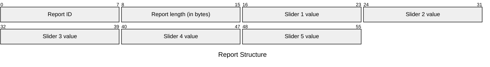

# M005S Input Reports

## Channel 0 (Tag `0x2a`)

### `0x02` - Slider Event

| Element | Description | Acceptable Values |
| --- | --- | --- |
| Report ID | The ID of the report. | Always `0x00` (`0`). |
| Report length | The number of remaining bytes in the report. | Always `0x05` (`5`), matching the number of sliders. |
| Slider 1 value | The current value of Slider 1. | Integers in the range `[0x00, 0x64]` (`[0, 100]`). |
| Slider 2 value | The current value of Slider 2. | Integers in the range `[0x00, 0x64]` (`[0, 100]`). |
| Slider 3 value | The current value of Slider 3. | Integers in the range `[0x00, 0x64]` (`[0, 100]`). |
| Slider 4 value | The current value of Slider 4. | Integers in the range `[0x00, 0x64]` (`[0, 100]`). |
| Slider 5 value | The current value of Slider 5. | Integers in the range `[0x00, 0x64]` (`[0, 100]`). |

Example: `02 05 33 00 64 19 4b`

## Channel 1 (Tag `0x2b`)

No reports have been found for this channel.

## Channel 2 (Tag `0x2c`)

No reports have been found for this channel.

## Channel 3 (Tag `0x2d`)

No reports have been found for this channel.

## Channel 4 (Tag `0x2e`)

No reports have been found for this channel.
