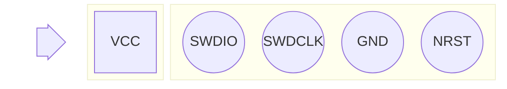

# M0064 Recovery

When firmware updates go bad or other corruption happens, it is necessary to flash the microcontroller with a working firmware package to recover.

The following tools are needed to proceed with this guide:
* [Raspberry Pi Debug Probe](https://www.raspberrypi.com/products/debug-probe/)
* [OpenOCD](https://openocd.org/pages/getting-openocd.html)

Alternative methods exist, but are not documented here.

## Preparing the circuit board

The M0064 module uses a [Nuvoton M032LE3AE](https://www.nuvoton.com/products/microcontrollers/arm-cortex-m0-mcus/m032-series/m032le3ae/) microcontroller. The debug header is nearby, labelled `SWD1`:



1. Using the 3-pin JST connector to 0.1-inch header (male), connect the 3-pin JST side to the Raspberry Pi Debug Probe using the `DEBUG` serial interface and the 0.1 headers according to the following pinout:

    | SWD1 Pad | Wire Color |
    | --- | --- |
    | SWDIO | Yellow |
    | SWDCLK | Orange |
    | GND | Black |

1. Using the USB to Micro USB cable, connect the Micro USB side to the Raspberry Pi Debug Probe and the USB side into your computer.

1. Power on the module using its USB-C cable.

## Preparing the firmware package

See [firmware.md](../firmware.md) for downloading official firmware packages.

> **IMPORTANT**
>
> The guide assumes that you have downloaded an official firmware package to `/tmp/base_firmware.bin`.

> **TIP**
>
> You can download the firmware package, move, and rename it in one step using `curl`:
>
>   ```bash
>   /usr/bin/curl '<url>' -o '/tmp/base_firmware.bin'
>   ```
>
> Replace `<url>` with the appropriate download URL for the firmware package.

1. Verify the firmware package to ensure it is for the appropriate module.

    ```bash
    /usr/bin/xxd '/tmp/base_firmware.bin' | /usr/bin/head -4
    ```

    ```
    00000000: 436f 6f6c 6572 4d61 7374 6572 204d 3030  CoolerMaster M00
    00000010: 3634 204d 3033 324c 4520 2020 a85e 0000  64 M032LE   .^..
    00000020: 1254 4c2f b831 0020 f100 0000 1701 0000  .TL/.1. ........
    00000030: d500 0000 0000 0000 0000 0000 0000 0000  ................
    ```

    In this case, the firmware package is for the CoolerMaster M0064 with M032LE MCU. This is the correct module and microcontroller.

1. Remove the firmware package header.

    ```bash
    /bin/dd if='/tmp/base_firmware.bin' of='/tmp/base_firmware_raw.bin' bs=1 skip=36
    ```

    Verify that the header was removed:

    ```bash
    /usr/bin/xxd '/tmp/base_firmware_raw.bin' | /usr/bin/head -2
    ```

    ```
    00000000: b831 0020 f100 0000 1701 0000 d500 0000  .1. ............
    00000010: 0000 0000 0000 0000 0000 0000 0000 0000  ................
    ```

    This starts with the byte sequence `b8 31 00 20 f1 00 00 00`, which is the stack pointer and reset vector. This is the expected entry point for the firmware once it's flashed.

## Flash the microcontroller

Use OpenOCD to connect to and reset the microcontroller. See [connect.cfg](../../../../openocd/MasterHUB/m0064/connect.cfg) for configuration and [recover.cfg](../../../../openocd/MasterHUB/m0064/recover.cfg) for commands.

  ```bash
  /usr/local/bin/openocd -f ./openocd/MasterHUB/m0064/recover.cfg
  ```

The module should perform a hard reset and resume normal operation.
