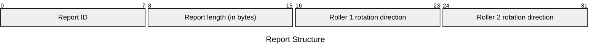

# M032LE Input Reports

## Channel 0 (Tag `0x2a`)

### `0x01` - Roller Rotation Event

| Element | Description | Acceptable Values |
| --- | --- | --- |
| Report ID | The ID of the report. | Always `0x01` (`1`). |
| Report length | The number of remaining bytes in the report. | Always `0x02` (`2`), matching the number of rollers. |
| Roller 1 rotation direction | The direction of rotation for Roller 1. | Either `0x00` (`0`) for up or `0x01` (`1`) for down. The value `0xff` (`255`) appears to denote "no change." |
| Roller 2 rotation direction | The direction of rotation for Roller 2. | Either `0x00` (`0`) for up or `0x01` (`1`) for down. The value `0xff` (`255`) appears to denote "no change." |

Example: `01 02 00 ff`

## Channel 1 (Tag `0x2b`)

No reports have been found for this channel.

## Channel 2 (Tag `0x2c`)

No reports have been found for this channel.

## Channel 3 (Tag `0x2d`)

No reports have been found for this channel.

## Channel 4 (Tag `0x2e`)

No reports have been found for this channel.
