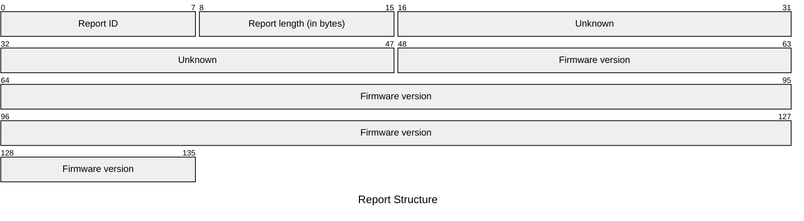
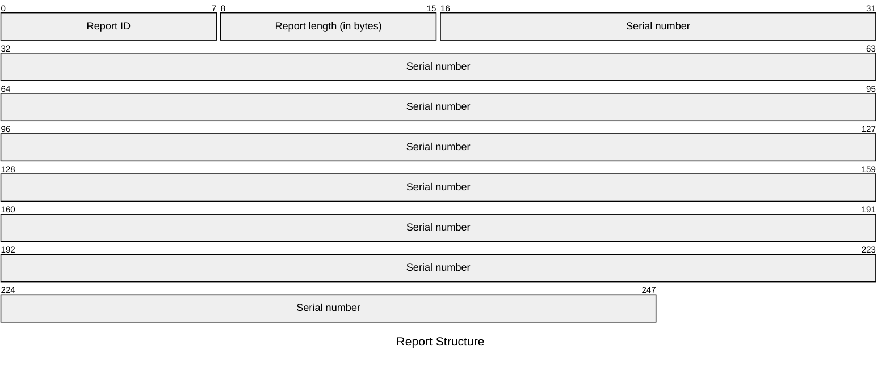
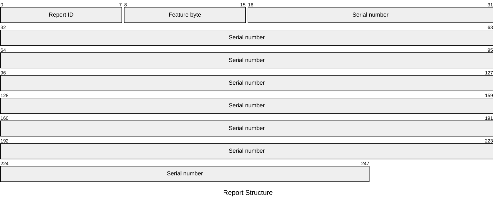
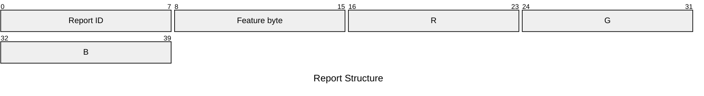
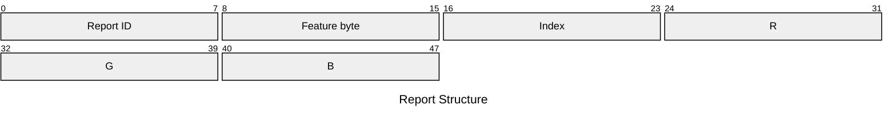

# M4315 Feature Reports

## Get Feature Reports

### `0x37` - Get FW Infos

| Element | Description | Acceptable Values |
| --- | --- | --- |
| Report ID | The ID of the report. | Always `0x37` (`55`) |
| Report length | The number of remaining bytes in the report. | Potentially `0x00` (`0`) to `0x78` (`120`) |
| Unknown | The purpose has not been discovered. | |
| Firmware version | The current firmware version. | Apparently an 11-character UTF-8 string. |

Example: `37 0f 54 63 af ef 30 31 2e 30 30 2e 30 30 2e 30 30`

> **WARNING**
>
> This feature report appears in the SDK but is unused by the application. See feature report `0x2e` for the one used by the application.

This seems to contain a very low firmware version, perhaps the lowest supported or factory original version.

#### Postprocessing

The SDK splits the 15 bytes into a 4-byte and 11-byte pair. The firmware version number appears to be in the 11-byte part.

<table>
    <tr>
        <th>Byte</th>
        <td>54</td>
        <td>63</td>
        <td>af</td>
        <td>ef</td>
        <td>30</td>
        <td>31</td>
        <td>2e</td>
        <td>30</td>
        <td>30</td>
        <td>2e</td>
        <td>30</td>
        <td>30</td>
        <td>2e</td>
        <td>30</td>
        <td>30</td>
        <td>00</td>
    </tr>
    <tr>
        <th>UTF-8</th>
        <td>T</td>
        <td>c</td>
        <td>¯</td>
        <td>ï</td>
        <td>0</td>
        <td>1</td>
        <td>.</td>
        <td>0</td>
        <td>0</td>
        <td>.</td>
        <td>0</td>
        <td>0</td>
        <td>.</td>
        <td>0</td>
        <td>0</td>
        <td></td>
    </tr>
</table>

The 4-byte part seems to be interpreted differently. I have not found any use for it in the rest of the application so it may be unused.

### `0x38` - Get FW Infos

| Element | Description | Acceptable Values |
| --- | --- | --- |
| Report ID | The ID of the report. | Always `0x38` (`56`) |
| Report length | The number of remaining bytes in the report. | Potentially `0` to `0x78` (`120`) |
| Unknown | The purpose has not been discovered. | |
| Firmware version | The current firmware version. | An 11-character UTF-8 string. |

Example: `38 0f 29 63 1c 5d 30 32 2e 30 30 2e 30 31 2e 30 30`

> **IMPORTANT**
>
> This is the feature report that is consistently used by the application to get the module's firmware version.

This seems to contain the current firmware version.

#### Postprocessing

The SDK splits the 15 bytes into a 4-byte and 11-byte pair. The firmware version number appears to be in the 11-byte part.

<table>
    <tr>
        <th>Byte</th>
        <td>29</td>
        <td>63</td>
        <td>1c</td>
        <td>5d</td>
        <td>30</td>
        <td>32</td>
        <td>2e</td>
        <td>30</td>
        <td>30</td>
        <td>2e</td>
        <td>30</td>
        <td>31</td>
        <td>2e</td>
        <td>30</td>
        <td>30</td>
        <td>00</td>
    </tr>
    <tr>
        <th>UTF-8</th>
        <td>)</td>
        <td>c</td>
        <td></td>
        <td>]</td>
        <td>0</td>
        <td>2</td>
        <td>.</td>
        <td>0</td>
        <td>0</td>
        <td>.</td>
        <td>0</td>
        <td>1</td>
        <td>.</td>
        <td>0</td>
        <td>0</td>
        <td></td>
    </tr>
</table>

The 4-byte part seems to be interpreted differently. I have not found any use for it in the rest of the application so it may be unused.

### `0x39` - Get FW Infos

| Element | Description | Acceptable Values |
| --- | --- | --- |
| Report ID | The ID of the report. | Always `0x39` (`57`) |
| Report length | The number of remaining bytes in the report. | Potentially `0` to `0x78` (`120`) |
| Unknown | The purpose has not been discovered. | |
| Firmware version | The current firmware version. | An 11-character UTF-8 string. |

Example: `39 0f 29 63 1c 5d 30 32 2e 30 30 2e 30 31 2e 30 30`

> **WARNING**
>
> This feature report appears in the SDK but is unused by the application. See feature report `0x2e` for the one used by the application.

This seems to contain the same or higher version than `0x2d` or `0x2e`. This is possibly the firmware version that has been uploaded to/staged on the device.

#### Postprocessing

The SDK splits the 15 bytes into a 4-byte and 11-byte pair. The firmware version number appears to be in the 11-byte part.

<table>
    <tr>
        <th>Byte</th>
        <td>29</td>
        <td>63</td>
        <td>1c</td>
        <td>5d</td>
        <td>30</td>
        <td>32</td>
        <td>2e</td>
        <td>30</td>
        <td>30</td>
        <td>2e</td>
        <td>30</td>
        <td>31</td>
        <td>2e</td>
        <td>30</td>
        <td>30</td>
        <td>00</td>
    </tr>
    <tr>
        <th>UTF-8</th>
        <td>)</td>
        <td>c</td>
        <td></td>
        <td>]</td>
        <td>0</td>
        <td>2</td>
        <td>.</td>
        <td>0</td>
        <td>0</td>
        <td>.</td>
        <td>0</td>
        <td>1</td>
        <td>.</td>
        <td>0</td>
        <td>0</td>
        <td></td>
    </tr>
</table>

The 4-byte part seems to be interpreted differently. I have not found any use for it in the rest of the application so it may be unused.

### `0x3a` - Get Serial Number

| Element | Description | Acceptable Values |
| --- | --- | --- |
| Report ID | The ID of the report. | Always `0x3a` (`58`) |
| Report length | The number of remaining bytes in the report. | Potentially `0` to `0x1d` (`29`) |
| Serial number | The current serial number. | A UTF-8 encoded string with up to 29 bytes. |

Example: `3a 14 4d 48 4b 44 31 35 41 41 34 33 31 32 34 32 34 30 30 30 32 39`

> **NOTE**
>
> The SDK checks whether the serial number is less than or equal to `0x1d` (`29`). It is unclear at this point if that includes the C-style `null` terminator at the end of the string. The byte buffer is size `0x20` (`32`); if the `null` terminator is included then we would fill `0x1f` (`31`) bytes, while if it was not included we would fill all `0x20` (`32`) bytes.
>
> It's possible the last byte is potentially unused or an implicit `null` terminator. In practice, the serial numbers seem to only be about 20 characters.

#### Postprocessing

The serial number is a C-style UTF-8 string (with a `null` terminator) encoded as bytes.

<table>
    <tr>
        <th>Byte</th>
        <td>4d</td>
        <td>48</td>
        <td>4b</td>
        <td>44</td>
        <td>31</td>
        <td>35</td>
        <td>41</td>
        <td>41</td>
        <td>34</td>
        <td>33</td>
        <td>31</td>
        <td>32</td>
        <td>34</td>
        <td>32</td>
        <td>34</td>
        <td>30</td>
        <td>30</td>
        <td>30</td>
        <td>32</td>
        <td>39</td>
    </tr>
    <tr>
        <th>UTF-8</th>
        <td>M</td>
        <td>H</td>
        <td>K</td>
        <td>D</td>
        <td>1</td>
        <td>5</td>
        <td>A</td>
        <td>A</td>
        <td>4</td>
        <td>3</td>
        <td>1</td>
        <td>2</td>
        <td>4</td>
        <td>2</td>
        <td>4</td>
        <td>0</td>
        <td>0</td>
        <td>0</td>
        <td>2</td>
        <td>9</td>
    </tr>
</table>

The first part of the serial number appears to also contain the model number. See [model numbers](../model_numbers.md) for information on significant bits of the model number.

### `0x3b` - Get Device Infos

This feature appears in the SDK but is unused by the application and appears to return an empty response. It is possibly an unused/legacy endpoint.

Example: `3b 0b 14 03 05 0f e0 01 10 01 01 48 48`

### `0x3c` - Get Backlight

| Element | Description | Acceptable Values |
| --- | --- | --- |
| Report ID | The ID of the report. | Always `0x3c` (`60`). |
| Report length | The number of remaining bytes in the report. | Always `0x01` (`1`) |
| Brightness | The current backlight brightness. | Integers in the range `[0x00, 0x64]` (`[0, 100]`) |

Example: `3c 01 64`

### `0x3d` - Get Animation Infos

Work on this report is still in progress.

Example: `3d 11 32 4a ac bc d3 85 07 00 32 4a ac bc d3 85 07 00 00`

### `0x3e` - Get Config Infos

This feature report appears in the SDK but the report structure is unknown.

Example: `3e 10 a0 24 e4 ac 74 00 00 00 a0 24 e4 ac 74 00 00 00`

## Send Feature Reports

### Report ID `0x03`

#### `0x34` - Adjust Backlight

| Element | Description | Acceptable Values |
| --- | --- | --- |
| Report ID | The ID of the report. | Always `0x03` (`3`). |
| Feature byte | The feature to target. | Always `0x34` (`52`). |
| Brightness | The backlight brightness. | Integers in the range `[0x00, 0x64]` (`[0, 100]`). |

Example: `03 34 64`

#### `0x35` - Set Serial Number

| Element | Description | Acceptable Values |
| --- | --- | --- |
| Report ID | The ID of the report. | Always `0x03` (`3`). |
| Feature byte | The feature to target. | Always `0x35` (`53`). |
| Serial number | The serial number string. | A UTF-8 encoded string with up to 29 bytes. |

> **NOTE**
>
> The SDK checks whether the serial number is less than or equal to `0x1d` (`29`). It is unclear at this point if that includes the C-style `null` terminator at the end of the string. The byte buffer is size `0x20` (`32`); if the `null` terminator is included then we would fill `0x1f` (`31`) bytes, while if it was not included we would fill all `0x20` (`32`) bytes.
>
> It's possible the last byte is potentially unused or an implicit `null` terminator. In practice, the serial numbers seem to only be about 20 characters.

#### `0x36` - Display Color On Screen

| Element | Description | Acceptable Values |
| --- | --- | --- |
| Report ID | The ID of the report. | Always `0x03` (`3`). |
| Feature byte | The operation to perform. | Always `0x36` (`54`). |
| R | The red channel of the RGB color. | Integers in the range `[0x00, 0xFF]` (`[0, 255]`). |
| G | The green channel of the RGB color. | Integers in the range `[0x00, 0xFF]` (`[0, 255]`). |
| B | The blue channel of the RGB color. | Integers in the range `[0x00, 0xFF]` (`[0, 255]`). |

Example: `03 36 33 24 3f`

#### `0x37` - Display Color On Button

| Element | Description | Acceptable Values |
| --- | --- | --- |
| Report ID | The ID of the report. | Always `0x03` (`3`). |
| Feature byte | The operation to perform. | Always `0x37` (`55`). |
| Index | The key index to target. | Integers in the range `[0x00, 0x0e]` (`[0, 14]`) for an individual key. |
| R | The red channel of the RGB color. | Integers in the range `[0x00, 0xFF]` (`[0, 255]`). |
| G | The green channel of the RGB color. | Integers in the range `[0x00, 0xFF]` (`[0, 255]`). |
| B | The blue channel of the RGB color. | Integers in the range `[0x00, 0xFF]` (`[0, 255]`). |

Example: `03 37 00 33 24 3f`

#### `0x39` - Test FW Recovery Process

| Element | Description | Acceptable Values |
| --- | --- | --- |
| Report ID | The ID of the report. | Always `0x03` (`3`). |
| Feature byte | The feature to target. | Always `0x39` (`57`). |

This output report appears to reset the firmware to a known state. This state probably comes from feature report `0x39`, as sending it seems to cause feature report `0x38` to have the same version number as `0x39`.

#### `0x3a` - Set SW Mode

| Element | Description | Acceptable Values |
| --- | --- | --- |
| Report ID | The ID of the report. | Always `0x03` (`3`). |
| Feature byte | The operation to perform. | Always `0x3a` (`58`). |
| Mode | The mode for the HID to operate in. | Either `0x00` (`0`) for hardware mode or `0x01` (`1`) for software mode. |

> **IMPORTANT**
>
> The module does not appear to accept or generate _any_ reports unless it is in software mode.

#### `0x3c` - Save Factory Data

| Element | Description | Acceptable Values |
| --- | --- | --- |
| Report ID | The ID of the report. | Always `0x03` (`3`). |
| Feature byte | The feature to target. | Always `0x3c` (`60`). |

This output report appears in the SDK but it is unclear what, if anything, it does.

#### `0x3d` - Test Factory Reset Process

| Element | Description | Acceptable Values |
| --- | --- | --- |
| Report ID | The ID of the report. | Always `0x03` (`3`). |
| Feature byte | The feature to target. | Always `0x3d` (`61`). |

This output report appears to reset all device settings to their default. This does not appear to revert back to the original firmware version, but rather resets LED brightness, color, mode, etc.

#### `0x3e` - Test Animation Recovery Process

Work on this report is still in progress.
