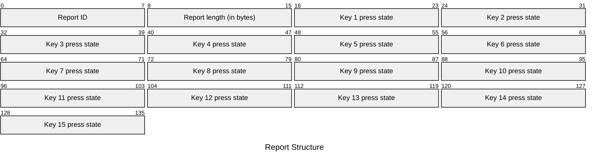

# M4315 Input Reports

## Channel 0 (Tag `0x34`)

### `0x02` - Key Press Event

| Element | Description | Acceptable Values |
| --- | --- | --- |
| Report ID | The ID of the report. | Always `0x02` (`2`). |
| Report length | The number of remaining bytes in the report. | Always `0x0f` (`15`), matching the number of keys. |
| Key 1 press state | The press state of Key 1. | Either `0x00` (`0`) for not pressed or `0x01` (`1`) for pressed. |
| Key 2 press state | The press state of Key 2. | Either `0x00` (`0`) for not pressed or `0x01` (`1`) for pressed. |
| Key 3 press state | The press state of Key 3. | Either `0x00` (`0`) for not pressed or `0x01` (`1`) for pressed. |
| Key 4 press state | The press state of Key 4. | Either `0x00` (`0`) for not pressed or `0x01` (`1`) for pressed. |
| Key 5 press state | The press state of Key 5. | Either `0x00` (`0`) for not pressed or `0x01` (`1`) for pressed. |
| Key 6 press state | The press state of Key 6. | Either `0x00` (`0`) for not pressed or `0x01` (`1`) for pressed. |
| Key 7 press state | The press state of Key 7. | Either `0x00` (`0`) for not pressed or `0x01` (`1`) for pressed. |
| Key 8 press state | The press state of Key 8. | Either `0x00` (`0`) for not pressed or `0x01` (`1`) for pressed. |
| Key 9 press state | The press state of Key 9. | Either `0x00` (`0`) for not pressed or `0x01` (`1`) for pressed. |
| Key 10 press state | The press state of Key 10. | Either `0x00` (`0`) for not pressed or `0x01` (`1`) for pressed. |
| Key 11 press state | The press state of Key 11. | Either `0x00` (`0`) for not pressed or `0x01` (`1`) for pressed. |
| Key 12 press state | The press state of Key 12. | Either `0x00` (`0`) for not pressed or `0x01` (`1`) for pressed. |
| Key 13 press state | The press state of Key 13. | Either `0x00` (`0`) for not pressed or `0x01` (`1`) for pressed. |
| Key 14 press state | The press state of Key 14. | Either `0x00` (`0`) for not pressed or `0x01` (`1`) for pressed. |
| Key 15 press state | The press state of Key 15. | Either `0x00` (`0`) for not pressed or `0x01` (`1`) for pressed. |

Example: `02 0f 01 00 00 00 00 00 00 00 00 00 00 00 00 00 00`

## Channel 1 (Tag `0x35`)

No reports have been found for this channel.

## Channel 2 (Tag `0x36`)

No reports have been found for this channel.

## Channel 3 (Tag `0x37`)

No reports have been found for this channel.

## Channel 4 (Tag `0x38`)

No reports have been found for this channel.
