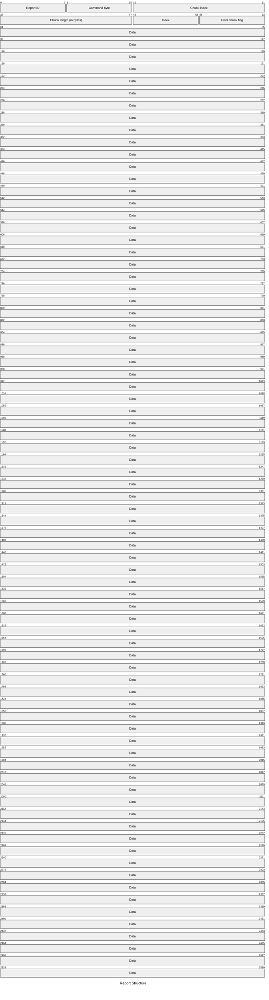
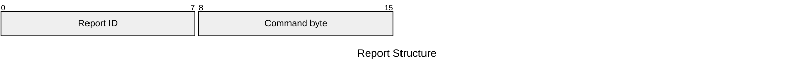

# M4315 Output Reports

## Report ID `0x02`

### Command `0x34` - Update FW

Work on this report is still in progress.

### Command `0x35` - Display Picture On Screen

Work on this report is still in progress.

### Command `0x36` - Display Picture On Button



| Element | Description | Acceptable Values |
| --- | --- | --- |
| Report ID | The ID of the report. | Always `0x02` (`2`). |
| Command byte | The operation to perform. | Always `0x36` (`54`). |
| Chunk index | The current chunk index. | Integers in the range `[0x00, 0xff]` (`[0, 255]`). |
| Chunk length | The length of the current chunk in bytes. | Integers in the range `[0x00, 0xff]` (`[0, 255]`). |
| Index | The key index to target. | Integers in the range `[0x00, 0x0e]` (`[0, 14]`) for an individual key. |
| Final chunk flag | Whether the current chunk is the last chunk. | Either `0x00` (`0`) if `false` or `0x01` (`1`) if `true`. |
| Data | Sequence of up to 312 bytes containing the raw image data. | Integers in the range `[0x00, 0xff]` (`[0, 255]`). |

This is a pretty standard data transfer method. The image is split into `0x0138`-byte (`312`-byte) chunks. The remaining `0x08` (`8`) bytes make up the packet header.

#### Algorithm

The following algorithm may be used to send a sequence of bytes (`image`) to a HID (`device`).

> **IMPORTANT**
>
> The application converts all images to a JPG before sending the raw bytes to the SDK.
>
> No other image formats have been found to work so far.

```
display_picture_on_button(device, index, image):
    image_len ← |image|

    if image = ∅ ∨ image_len = 0:
        return

    REPORT_LEN ← 0x0140
    CHUNK_MAX ← REPORT_LEN - 0x08   -- 0x0138

    report ← [0x00 × REPORT_LEN]
    report[0] ← 0x02
    report[1] ← 0x36
    report[6] ← index

    remaining ← image_len
    chunk_index ← 0

    while remaining > 0:
        chunk_len     ← min(remaining, CHUNK_MAX)
        is_last_chunk ← remaining ≤ CHUNK_MAX

        report[2..4] ← chunk_index as u16 (LE)
        report[4..6] ← chunk_len   as u16 (LE)
        report[7]    ← is_last_chunk ? 1 : 0

        src_offset ← image_len - remaining
        report[8 .. 8 + chunk_len] ← image[src_offset .. src_offset + chunk_len]

        call hid_write(device, report, REPORT_LEN)

        chunk_index ← chunk_index + 1
        remaining   ← remaining - chunk_len
```

### Command `0x38` - Save Screen Picture

Work on this report is still in progress.

### Command `0x39` - Get Config Data



| Element | Description | Acceptable Values |
| --- | --- | --- |
| Report ID | The ID of the report. | Always `0x02` (`2`). |
| Command byte | The operation to perform. | Always `0x39` (`57`). |

This output report appears to have no effect on the device.

### Command `0x3a` - Get Config Data


| Element | Description | Acceptable Values |
| --- | --- | --- |
| Report ID | The ID of the report. | Always `0x02` (`2`). |
| Command byte | The operation to perform. | Always `0x3a` (`58`). |

This output report appears to have no effect on the device.
