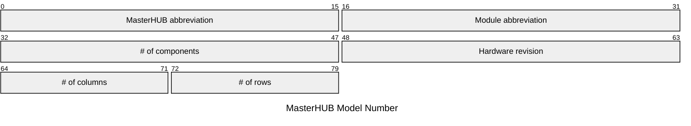

# Model Numbers

## Anatomy

Model numbers can be split into 5 two-character chunks.

| Element | Description | Acceptable Values |
| --- | --- | --- |
| MasterHUB abbreviation | An abbreviation of the MasterHUB product line. | Always `MH`. |
| Module abbreviation | An abbreviation of the MasterHUB module. | See below. |
| # of components | The number of interactable components in the module. | Integers in the range `[0, 99]`. |
| Hardware revision | The hardware revision of the module. | Always `AA`, but presumably every combination up to `ZZ`. |
| # of columns | The number of columns of the module's footprint. | Integers in the range `[0, 9]`. |
| # of rows | The number of rows of the module's footprint. | Integers in the range `[0, 9]`. |

Module abbreviations are as follows:

| Module | Name | Abbreviation |
| --- | --- | --- |
| M0064 | Base | BS |

## Known model numbers

### M0064

* MHBS01AA46
